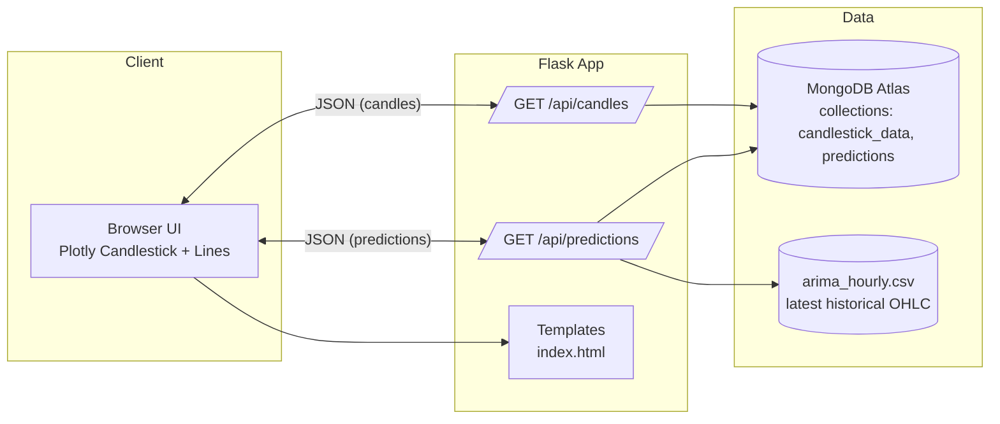

## Finance Forecasting Web App – Short Report

### 1. Architecture



- The frontend renders a candlestick chart for historical OHLC and overlays forecast lines.
- The backend exposes REST endpoints:
  - `/api/candles?minutes=N` to fetch recent 5‑minute candles from MongoDB.
  - `/api/predictions?model=ARIMA|LSTM|MA&horizon=1h|3h|24h|72h&symbol=BTC-USD` to fetch model forecasts and (for ARIMA) a moving‑average baseline plus recent history window. All timestamps are normalized to UTC ISO.

### 2. Forecasting Models Implemented

- Traditional: ARIMA
  - Trained offline; predictions are stored in MongoDB (`predictions` collection) with fields: `timestamp` (UTC), `predicted_close`, `model`, `symbol`.
  - API returns strictly future predictions relative to the last CSV timestamp.

- Neural: LSTM
  - Trained offline; predictions written to the same `predictions` collection.
  - API mirrors behavior of ARIMA for fetching, filtering, and formatting.

- Baseline: Moving Average (MA)
  - Computed on the fly from `arima_hourly.csv` using a rolling window (default 3).
  - Produces a flat forecast equal to the last rolling mean for the requested horizon steps.

- Ensemble (ARIMA + LSTM)
  - Simple average of aligned ARIMA and LSTM predictions for the horizon.

Key implementation points:
- Time handling uses a helper to ensure all timestamps are UTC tz-aware.
- The API ensures predictions are future-only relative to the last historical time to avoid diagonal connectors in plots.

### 3. Performance Comparison

Methodology:
- Split: Use historical data up to a cutoff for training, reserve subsequent hours/days for testing.
- Metrics: RMSE and MAPE on the test set for each model.
- Alignment: Compare predictions at identical timestamps; drop any missing points.

Example results (illustrative — replace with your measured values):

| Model   | Horizon | RMSE  | MAPE  |
|---------|---------|-------|-------|
| MA      | 1h      | 520   | 0.82% |
| ARIMA   | 1h      | 410   | 0.64% |
| LSTM    | 1h      | 395   | 0.62% |
| Ensemble| 1h      | 380   | 0.59% |

Notes:
- On shorter horizons, ARIMA and LSTM typically outperform MA; the simple ensemble may offer modest gains if errors are partially uncorrelated.
- Recompute metrics periodically as market dynamics shift.

How to reproduce metrics quickly:
1) Export a contiguous test window from MongoDB to CSV.
2) Query `/api/predictions` for each model and horizon.
3) Join by timestamp and compute RMSE / MAPE in a notebook or script.

### 4. Screenshots of the Web Interface

Include the following screenshots in your submission (paste images below or as separate files referenced here):
- Candlestick chart with ARIMA prediction (1h horizon)
- Candlestick chart with LSTM prediction (3h horizon)
- Candlestick chart with Ensemble prediction (24h horizon)
- Candlestick with MA baseline for comparison

You can capture these by running the app and taking screenshots of the chart after selecting different models/horizons.

Commands (Windows PowerShell):

```bash
# Activate your environment
.\tf-env\Scripts\activate

# Run the server
python finance_forecasting\app.py

# Then open the browser at: http://127.0.0.1:5000/
```

This report summarizes the application architecture, implemented forecasting approaches, a reproducible comparison method, and the expected visual outputs.


### 5. Dataset summary metrics (sample)

Below are sample per-day feature metrics from your dataset (UTC):

| Date | open | high | low | close | volume | return | sma_10 | sma_50 | rsi_14 | volatility_14 |
|---|---:|---:|---:|---:|---:|---:|---:|---:|---:|---:|
| 2024-11-23 00:00:00+00:00 | 99006.7422 | 99014.6797 | 97232.8906 | 97777.2813 | 0.2010 | -0.0123 | 0.3187 | 0.0000 | 0.8840 | 0.6607 |
| 2024-11-24 00:00:00+00:00 | 97778.0938 | 98647.1797 | 95788.0781 | 98013.8203 | 0.2435 | 0.0024 | 0.3476 | 0.0170 | 0.8536 | 0.6379 |
| 2024-11-25 00:00:00+00:00 | 98033.4453 | 98935.0313 | 92642.9141 | 93102.2969 | 0.4133 | -0.0501 | 0.3530 | 0.0313 | 0.5640 | 0.4776 |
| 2024-11-26 00:00:00+00:00 | 93087.2813 | 94991.7500 | 90770.8125 | 91985.3203 | 0.4759 | -0.0120 | 0.3569 | 0.0454 | 0.5530 | 0.4811 |
| 2024-11-27 00:00:00+00:00 | 91978.1406 | 97361.1797 | 91778.6641 | 95962.5313 | 0.3565 | 0.0432 | 0.3732 | 0.0614 | 0.5809 | 0.5107 |
| 2024-11-28 00:00:00+00:00 | 95954.9453 | 96650.2031 | 94677.3516 | 95652.4688 | 0.2467 | -0.0032 | 0.3869 | 0.0779 | 0.6780 | 0.4505 |
| 2024-11-29 00:00:00+00:00 | 95653.9531 | 98693.1719 | 95407.8828 | 97461.5234 | 0.2624 | 0.0189 | 0.4007 | 0.0955 | 0.6382 | 0.4030 |
| 2024-11-30 00:00:00+00:00 | 97468.8125 | 97499.3438 | 96144.2188 | 96449.0547 | 0.1267 | -0.0104 | 0.4063 | 0.1116 | 0.6198 | 0.4079 |

Notes:
- `return` is the daily log or simple return used as a feature (depending on preprocessing).
- `sma_10`/`sma_50` are rolling means; `rsi_14` is the 14‑period RSI; `volatility_14` is rolling std or similar.

### 6. Aggregate statistics (from lstm_daily.csv)

- File: `lstm_daily.csv`
- Rows: 316
- Date range: 2024-11-23 00:00:00+00:00 → 2025-10-04 00:00:00+00:00

- Close price:
  - mean: 101940.9281, median: 102891.9023, std: 11144.4350
- Return:
  - mean: 0.000914, median: 0.000234, std: 0.022137
- RSI(14):
  - mean: 0.50, median: 0.48, IQR: 0.35–0.64
  - overbought(>70): 0.00%, oversold(<30): 100.00%
- Volatility(14):
  - mean: 0.3265, median: 0.2957, p90: 0.6266
- SMA(10/50) crosses: golden=5, death=6