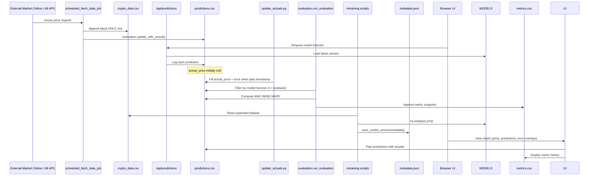
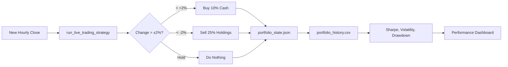

# Extended System Architecture & Data Flow

## 1. High-Level Component Architecture

```mermaid
flowchart LR
  subgraph Client[Browser]
    UI[Single Page UI\nPlotly Charts + Controls]
  end

  subgraph Flask[Flask App & Scheduler]
    API_C[/api/candles]
    API_P[/api/predictions]
    API_Port[/api/portfolio_performance]
    API_M[/api/metrics]
    API_Dash[/dashboard endpoints]
    SCHED[(APScheduler Jobs)]
  end

  subgraph DataLayer[Data & Models]
    CSV[(crypto_data.csv\n+ predictions.csv\n+ metrics.csv)]
    MDB[(MongoDB Atlas\nmodel metadata)]
    MODELS[(Model Artifacts\nARIMA .pkl / LSTM .h5)]
  end

  subgraph Training[Adaptive Training]
    Fetch[data_fetcher.py\nfetch hourly bar]
    Retrain[arima_model.py & lstm_model.py\nretrain when threshold met]
    Version[model_manager.save_model_version()]
  end

  subgraph Evaluation[Continuous Monitoring]
    Eval[evaluation.calculate_metrics()]
    UpdateActuals[update_actuals.py]
    Populate[populate_actuals.py]
  end

  UI <--> API_C
  UI <--> API_P
  UI <--> API_Port
  UI <--> API_M
  API_P --> MODELS
  API_P --> CSV
  Fetch --> CSV
  UpdateActuals --> CSV
  Populate --> CSV
  Eval --> CSV
  Retrain --> MODELS
  Retrain --> Version --> MDB
  SCHED --> Fetch
  SCHED --> Eval
  SCHED --> UpdateActuals
  SCHED --> Retrain
```

## 2. Data Flow Overview



## 3. Adaptive / Continuous Learning Loop

1. Ingestion: `data_fetcher.py` pulls the most recent completed hour (avoids partial candle noise).
2. Persistence: Row appended to `crypto_data.csv`; counter in `.new_rows_count` increments.
3. Trigger: When counter >= `RETRAIN_THRESHOLD` (currently 1 for demonstration) `trigger_retraining()` calls `arima_model.py` and `lstm_model.py`.
4. Versioning: Each training run calls `model_manager.save_model_version()` producing timestamped artifact + metadata snapshot (hyperparameters, initial metrics, data range).
5. Serving: `/api/predictions` always loads the latest model of requested type via `load_latest_model()`.
6. Post‑Prediction Logging: Every forecast logged with `log_prediction()` to `predictions.csv`.
7. Actuals Completion: `update_actuals.py` (hourly) and `populate_actuals.py` (manual bulk) fill `actual_price` and compute `error`.
8. Evaluation: `evaluation.run_evaluation()` computes rolling metrics (MAE, RMSE, MAPE) with configurable lookback and appends to `metrics.csv`.
9. Monitoring / Alerting: Frontend dashboard shows metric charts and highlights MAPE > 10% red alert bubble.

## 4. Portfolio Strategy Flow



## 5. Error Visualization Logic

- After actuals are known, each prediction row has: `predicted_price`, `actual_price`, and `error = predicted_price - actual_price`.
- UI builds a shaded band around past predictions using `±|error|` to emphasize divergence magnitude.
- Actual prices plotted as green markers; predicted trajectory remains dashed for historical context.

## 6. Key Resilience / Edge Case Handling

| Concern | Mitigation |
|---------|------------|
| Missing data hour | Skip append if fetch returns empty; no false row created. |
| yfinance outages | Existing cached `crypto_data.csv` used; manual population script available. |
| Path differences (Windows vs Docker) | `model_manager.load_latest_model` reconstructs relative model path if metadata absolute path invalid. |
| Malformed CSV rows | `on_bad_lines='skip'` and explicit `usecols` in population scripts. |
| Timezone drift | All timestamps coerced to UTC with `pd.to_datetime(..., utc=True)` and isoformat in API responses. |
| Metric inflation from sparse data | Evaluation requires non‑null `actual_price`; empty filtered set aborts metric write. |

## 7. Future Improvement Ideas

- Replace yfinance with a more stable crypto aggregator (Binance, CoinGecko) + fallback.
- Add drift detection: monitor distribution shift (e.g., KS test on returns) to force retrain independent of row count.
- Add model selection logic: store performance trend and auto‑promote only if new version outperforms baseline (canaried).
- Persist portfolio daily snapshots separately for longevity vs intraday volatility management.

## 8. Summary

This extended architecture combines hourly ingestion, automatic versioned retraining, continuous evaluation, and real‑time visualization with portfolio feedback. The minimal retraining threshold intentionally demonstrates the adaptive loop; scaling to production simply raises `RETRAIN_THRESHOLD`, adds stronger validation gates, and integrates external monitoring (Prometheus/Grafana) around the same flow.
